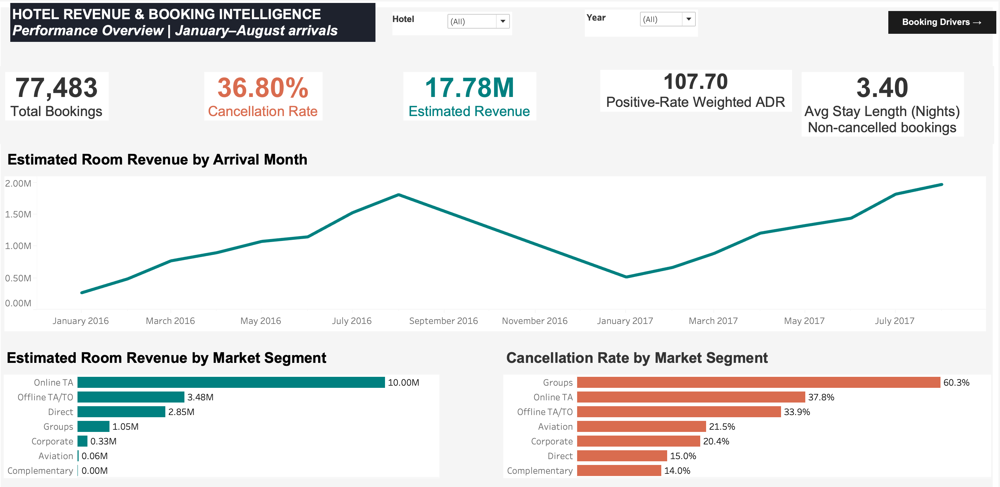
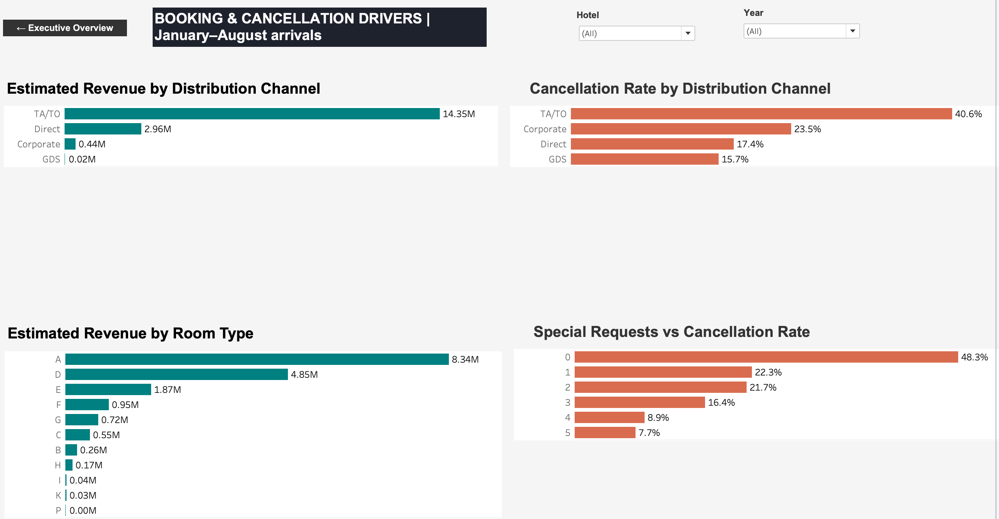

# Hotel Revenue& Booking Intelligence
End-to-end hospitality analytics project using Python, MySQL, SQL and Tableau to analyze 119,390 hotel bookings, revenue performance and cancellation drivers.

## Dashboard Preview

### Executive Performance Overview



### Booking & Cancellation Drivers



## Live Dashboard

[View the interactive Tableau dashboard](https://public.tableau.com/app/profile/aboubacar.bah3896/viz/HotelRevenueBookingIntelligence/Dashboard1)

## Project Overview

Hotel Revenue & Booking Intelligence is a hospitality analytics project built from 119,390 hotel booking records covering 2015–2017.

The project transforms raw booking data into business-focused insights using Python for data preparation, MySQL/SQL for analytical querying, and Tableau for interactive visualization.

The final solution consists of two Tableau dashboards:

1. Executive Performance Overview
2. Booking & Cancellation Drivers

The analysis focuses on revenue performance, booking volume, cancellations, average daily rate (ADR), length of stay, market segments, distribution channels, room types and booking behavior.

## Business Questions

The project was designed to answer questions such as:

- How is estimated hotel revenue changing over time?
- What is the overall booking cancellation rate?
- Which market segments generate the most revenue?
- Which market segments have the highest cancellation rates?
- Which distribution channels generate the most revenue?
- Which distribution channels carry the greatest cancellation risk?
- Which assigned room types contribute the most estimated revenue?
- How do special requests relate to cancellation behavior?
- How do performance indicators change by hotel and year?

- ## Key Performance Indicators

| KPI | Result |
|---|---:|
| Total Bookings | 119,390 |
| Cancellation Rate | 37.04% |
| Estimated Room Revenue | 26.00M |
| Average ADR | 102.4 |
| Average Length of Stay | 3.39 nights |

## Dashboard Features

### Executive Performance Overview
- Total Bookings
- Cancellation Rate
- Estimated Revenue
- Average ADR
- Average Length of Stay
- Monthly Revenue Trend
- Revenue by Market Segment
- Cancellation Rate by Market Segment
- Hotel filter
- Year filter

### Booking & Cancellation Drivers
- Revenue by Distribution Channel
- Cancellation Rate by Distribution Channel
- Revenue by Assigned Room Type
- Special Requests vs Cancellation Rate
- Interactive navigation between dashboards

- ## Technology Stack

- **Python** — data preparation and cleaning
- **SQL** — analytical queries and KPI development
- **MySQL** — relational database and analysis environment
- **Tableau Public** — dashboard development and interactive visualization

- ## Key Insights

- The dataset contains 119,390 hotel booking records.
- The overall cancellation rate is 37.04%, indicating that cancellations represent a significant operational and revenue-management challenge.
- Estimated room revenue across successful stays is approximately 26.00M.
- Average ADR is 102.4.
- Average length of stay is 3.39 nights.
- Online TA is the largest revenue-generating market segment in the analysis.
- Cancellation behavior varies significantly across market segments and distribution channels.
- Greater numbers of special requests are associated with substantially lower observed cancellation rates in the dataset.

## Project Workflow

1. **Data Preparation** — Cleaned the hotel booking dataset with Python, removed unnecessary whitespace, and generated a unique booking ID.
2. **Data Validation** — Used SQL to validate booking records, hotel categories, arrival years, ADR values, cancellation indicators, market segments, and distribution channels.
3. **Business Analysis** — Analyzed booking performance, cancellation drivers, customer behavior, lead time, special requests, and revenue performance using MySQL.
4. **Business Intelligence** — Built two interactive Tableau dashboards for executive performance monitoring and booking/cancellation driver analysis.
5. **Communication** — Converted analytical results into decision-ready hospitality KPIs and visual insights.

## Repository Structure

```text
hotel-revenue-booking-intelligence/
├── images/        # Tableau dashboard screenshots
├── python/        # Data cleaning script
├── sql/           # SQL validation and analytical queries
├── tableau/       # Tableau Public dashboard link
└── README.md      # Project documentation
```

## Key Business Takeaways

- The dataset contains **119,390 hotel bookings**.
- The overall cancellation rate is **37.04%**, highlighting cancellation management as a major business priority.
- Estimated room revenue from successful stays is approximately **26.00M**.
- Average ADR is **102.4**, while average length of stay is **3.39 nights**.
- Online TA generates the largest estimated revenue among market segments.
- Cancellation behavior varies substantially across market segments and distribution channels.
- Bookings with more special requests show lower observed cancellation rates in the dataset.

## Tools Used

**Python · SQL · MySQL · Tableau · GitHub**

## Author

**Aboubacar Bah**  
Junior BI & Data Analyst | Hospitality & Customer Analytics
